# Build Guide - Flat Assembly

This section of the build guide contains the steps to complete a Flat build.  This configuration is great for refractors, SCT's and other scopes with rear-focusers as the screen is 'flat' when mounted and the camera faces forward:

If you have not already followed the [general assembly guide](build_assembly.md) through to get to the point pictured below, please do so and then return here.

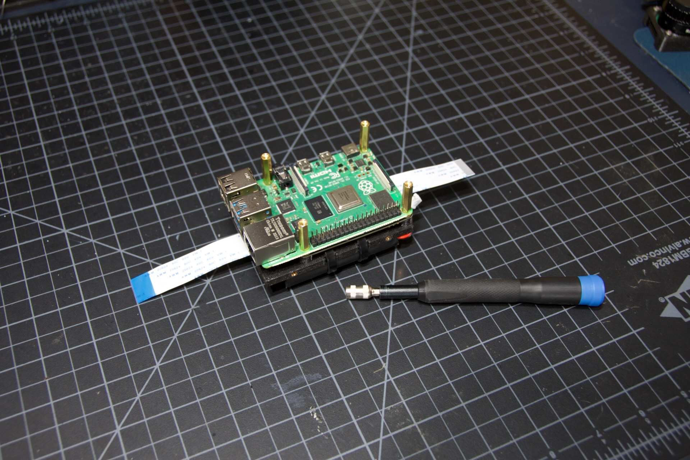

If you routed the cable as above, pull the camera cable out to remove it from the RPI assembly as the routing is different for a flat build.  

Collect the flat adapter and dovetail.  The dovetail will be secured to the underside of the flat adapter via screws through the adapter and the RPI mount assembly will slot into it the flat adapter and be secured via screws into the edge inserts.  See the photos below for details.
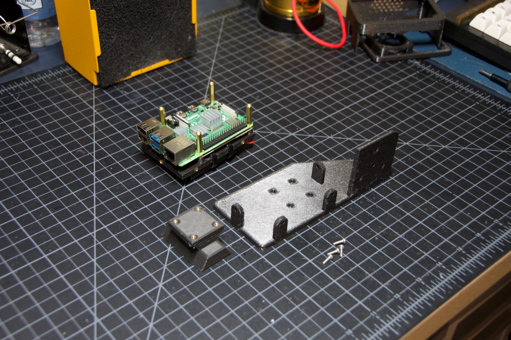

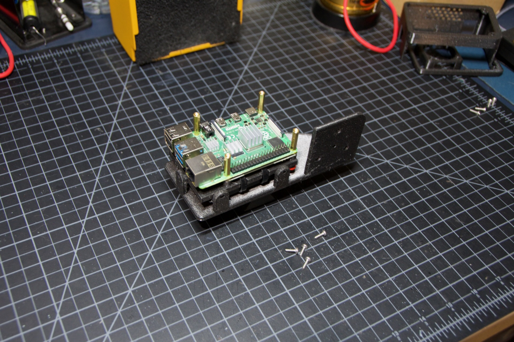
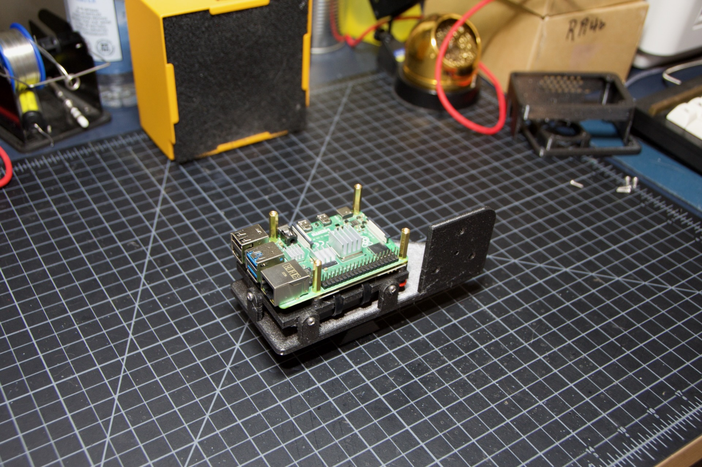

Note the one additional screw on the other side visible in the next photo.  Once the RPI Mount is secured to the flat adapter, connect the camera cable to the RPi and the Camera as shown below.

Turn the PiFinder around and screw in the three thumbscrews as shown.  Check for any excess plastic in the threads and if you run into resistance, try screwing them from the other side first to clear any obstruction.   Screw them most of the way in, but leave some amount for adjustment.

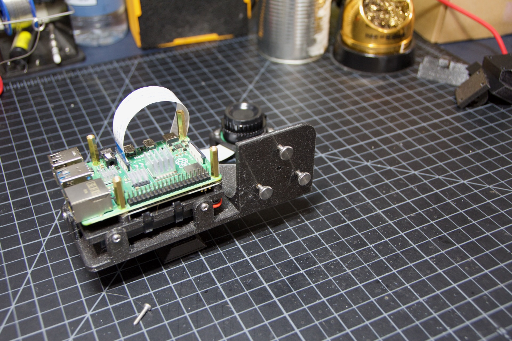

Next you'll position the camera module and use the longer M2.5 screw to secure it.  The screw should be inserted through the center hole in the flat adapter back and threaded into the center hole in the camera cell.  It should screw in 3-4mm and pull the camera cell against the ends of the three thumbscrews.  If it's not secure, extend the thumbscrews until it's supported.  No need to tighten anything too much here, you'll adjust again to align the PiFinder with your telescopes optical axis.

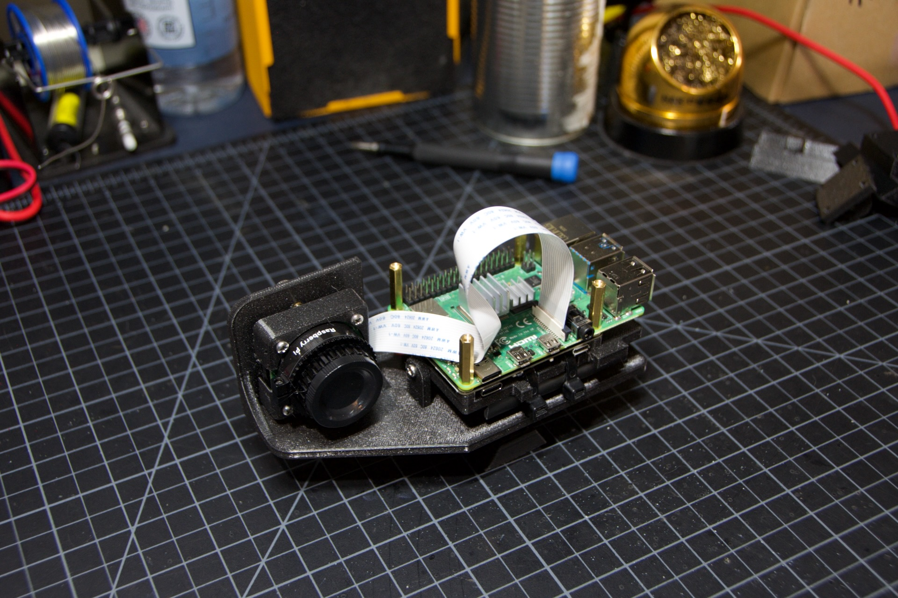

Gently plug in the UI Module, working to tuck the cable underneath it.  Take you time and make sure the camera cable is not pinched between the stand-offs and the UI Module.

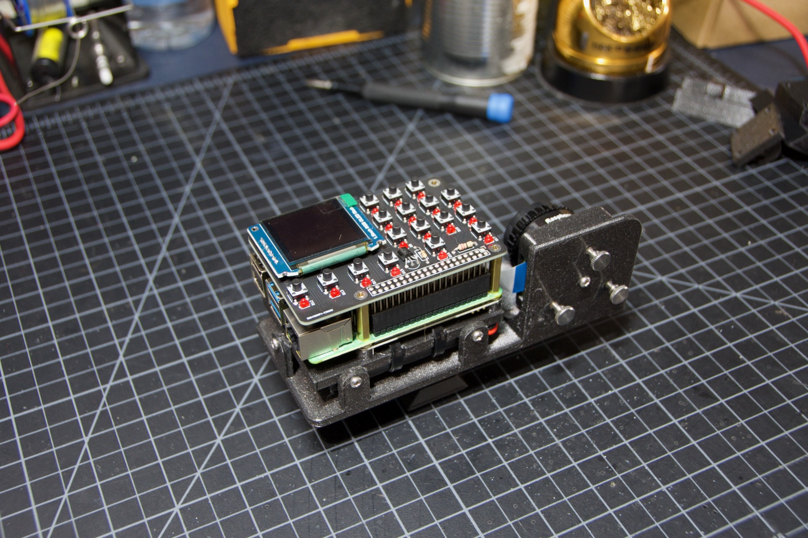
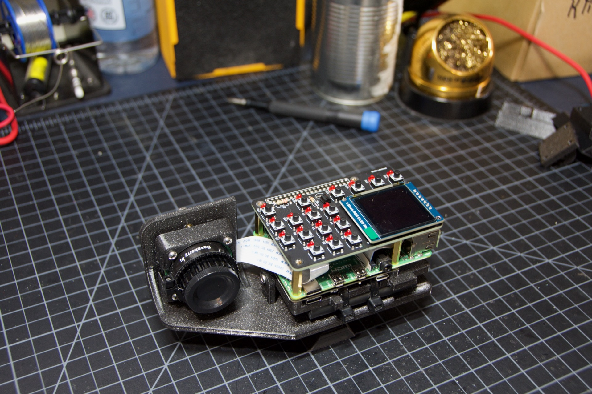
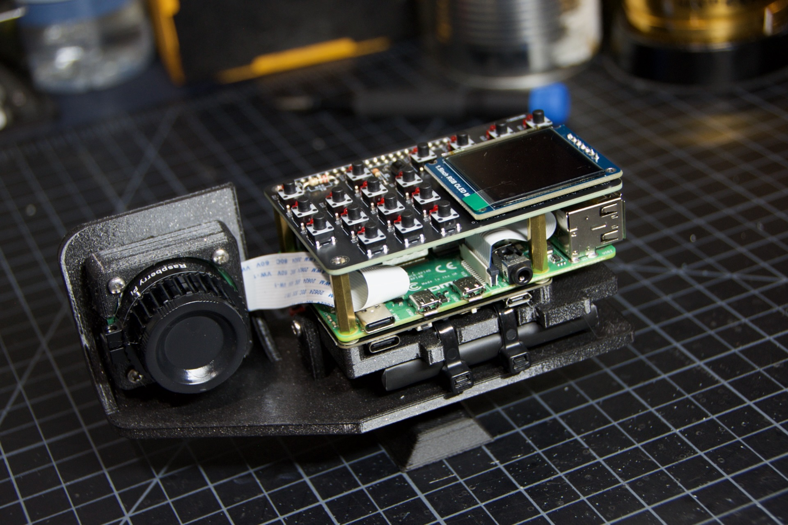

Once the UI Module is plugged in all the way and the cable is tidy, gather the remaining parts to wrap up the build!  The shroud will slip over the UI Module first, then the bezel slots on top and finally the top PCB.  Use three of the long screws to secure everything together per the photos below.

NOTE:  If you have not already flashed and inserted the SD card into the Raspberry Pi, nows a good time.  It will be harder to get to after the shroud is installed.  Also check to make sure the PiSugar power switch access is cut and punched out of the shroud if you are using a PiSugar.

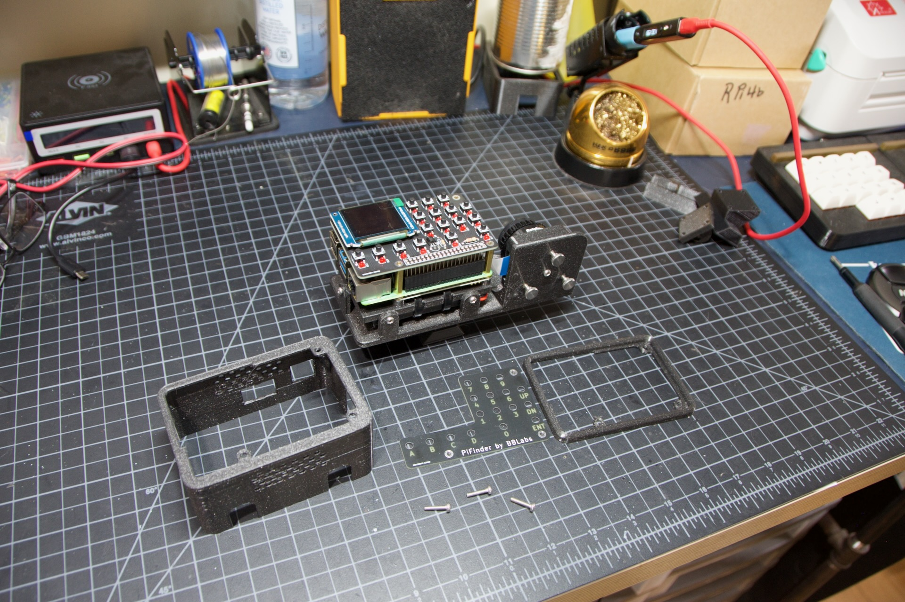

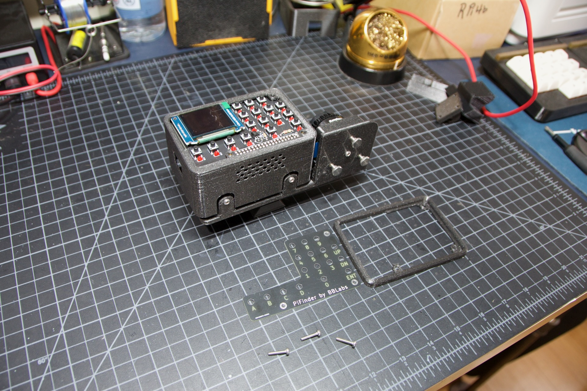

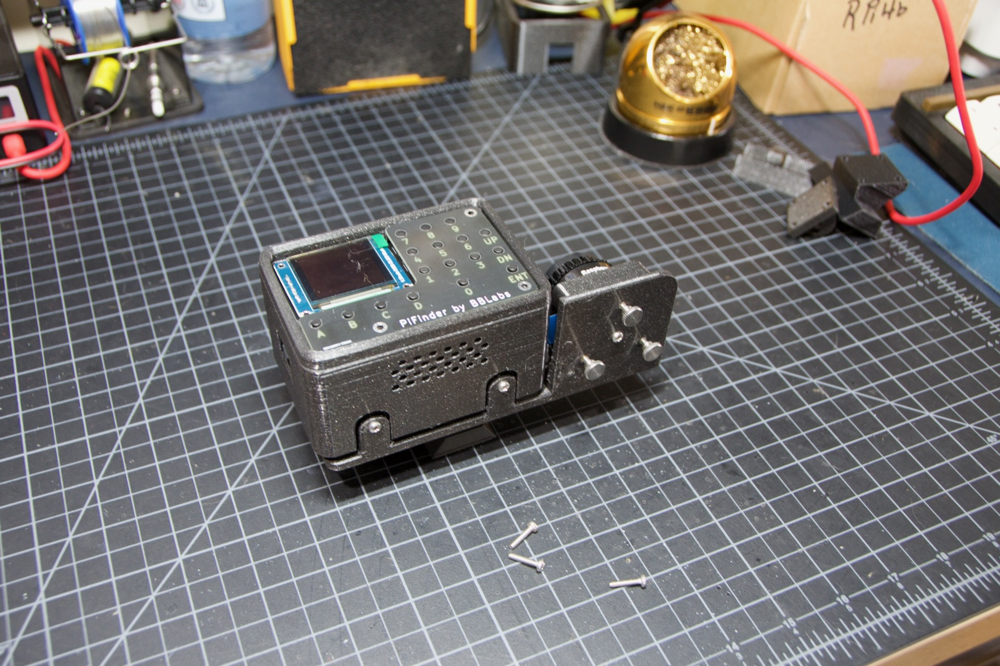
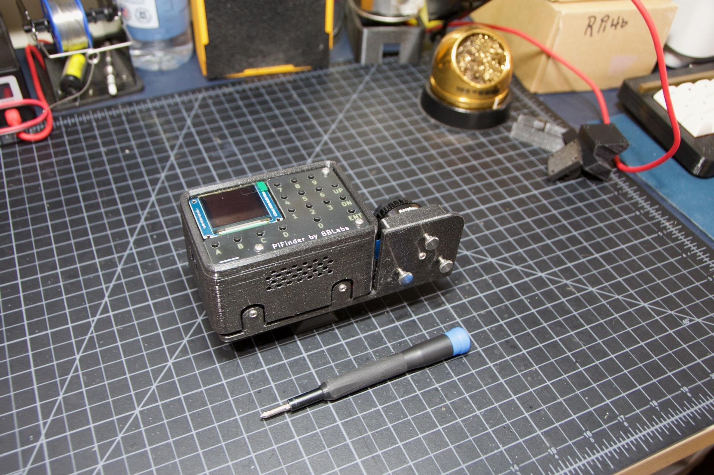

The only remaining thing to do is to affix the camera lens.  Unscrew the cap from the camera module, but make sure you leave the knurled adapter in place as it's required to get the focus distance correct.  Remove the cap from the silver end of the lens and gently screw them together.

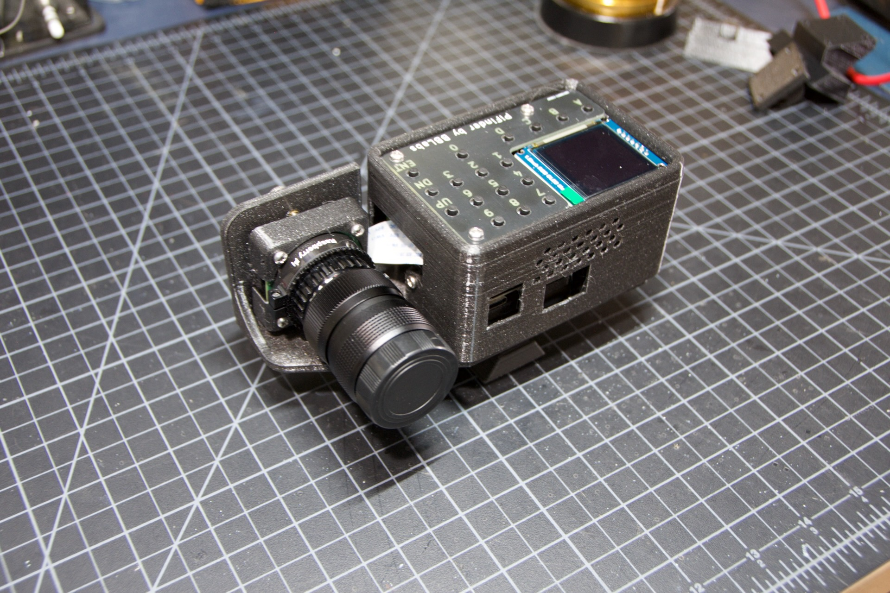

Now that your PiFinder is complete, here are some more resources for you:

* [Software Setup](software.md)
* [User Guide](user_buide.md)
* [Frequently Asked Questions](user_guide_faq.md)